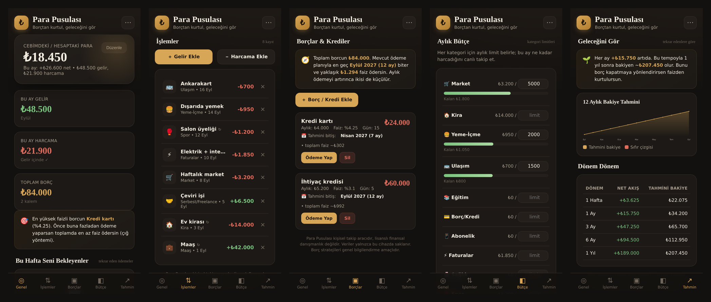

# Para Pusulası 🧭

**An offline-first personal finance PWA for tracking spending, paying off debt and forecasting your balance. All data stays on your device.**


-orange)


*Para Pusulası* ("Money Compass") is a mobile-first budgeting app for Turkish users. You install it to your home screen and it runs fully offline. It doesn't use a backend, an account or any tracking. Every transaction, debt and budget is stored locally in the browser's IndexedDB.



---

## Features

- **Overview dashboard.** Shows your current balance, this month's income and spending, net cash flow and total debt at a glance.
- **Transactions.** Add income and expenses with categories, notes and dates. You can mark items as recurring (rent, salary, subscriptions).
- **Debt & loan tracker.** Shows each debt's **estimated payoff date** and **total interest cost**, and suggests which debt to prioritise using the **avalanche method** (highest interest first).
- **Monthly budgets.** Set a limit for each category and watch live progress bars as the month goes on.
- **Balance forecast.** Projects your balance at 1 week, 1 month, 3 and 6 months and 1 year from recurring cash flow. It includes a 12-month chart built with no charting library.
- **Backup & restore.** Export all data to JSON and import it on a new device.
- **Installable & offline.** A service worker and web manifest let it install like a native app on iOS and Android.

## Tech stack

| Layer | Choice |
|---|---|
| UI | React 18 (function components + hooks) |
| Build | Vite 5 |
| Storage | IndexedDB via Dexie 4 and `dexie-react-hooks` (`useLiveQuery` for reactive UI) |
| Offline / install | `vite-plugin-pwa` (Workbox service worker, auto-update, web manifest) |
| Charts | Hand-written SVG with no external charting dependency |

## Getting started

Requires **Node.js 18+**.

```bash
git clone https://github.com/Atlass000/para-pusulasi.git
cd para-pusulasi
npm install
npm run dev        # http://localhost:5173
```

Production build:

```bash
npm run build      # outputs to dist/
npm run preview    # serve the production build locally
```

## Deployment

The `dist/` folder is a static site, so any static host will work:

- **Netlify:** run `npm run build`, then drag `dist/` onto <https://app.netlify.com/drop>
- **Vercel:** `npx vercel`
- **GitHub Pages:** set `base: '/para-pusulasi/'` in `vite.config.js` and publish `dist/`. You'll also need to update the manifest's `start_url` and `scope` to match.

### Install on a phone

Open the deployed URL, then:

- **iPhone (Safari):** Share → *Add to Home Screen*
- **Android (Chrome):** menu → *Install app*

## Project structure

```
src/
  App.jsx              app shell, tab navigation, modals, backup/restore
  components/views.jsx Home, Transactions, Debts, Budget and Forecast screens
  components/ui.jsx    shared UI primitives (cards, modal, SVG chart)
  finance.js           formatting, categories, totals, payoff & forecast math
  db.js                Dexie schema and export/import helpers
  styles.css           theme and layout
public/                PWA icons and favicon
docs/                  screenshots and the Turkish user guide
```

## Privacy

Data never leaves the device. If the browser's site data is cleared, the data is gone too, so use **Download backup** from the menu now and then.

## Disclaimer

Para Pusulası is a personal tracking tool, not licensed financial advice. Debt strategies are shown for general information only.

## Türkçe

Kişisel finans takip uygulaması: harcama, borç ve gelecek tahmini. Kurulum ve kullanım rehberi için [docs/KULLANIM_TR.md](docs/KULLANIM_TR.md) dosyasına bakın.

## Author

**Mohammed Mustafa Kareem**, Software Engineering, OSTIM Technical University

## License

[MIT](LICENSE)
